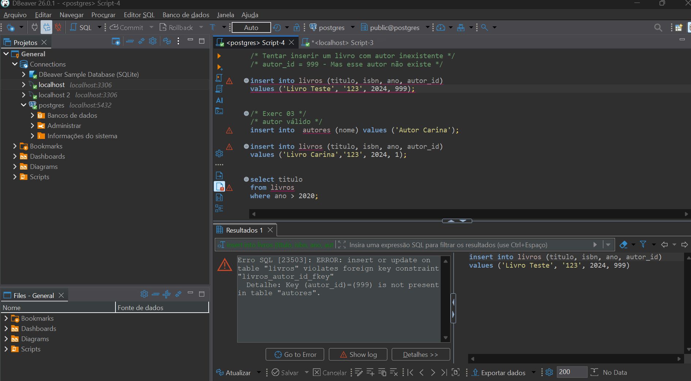
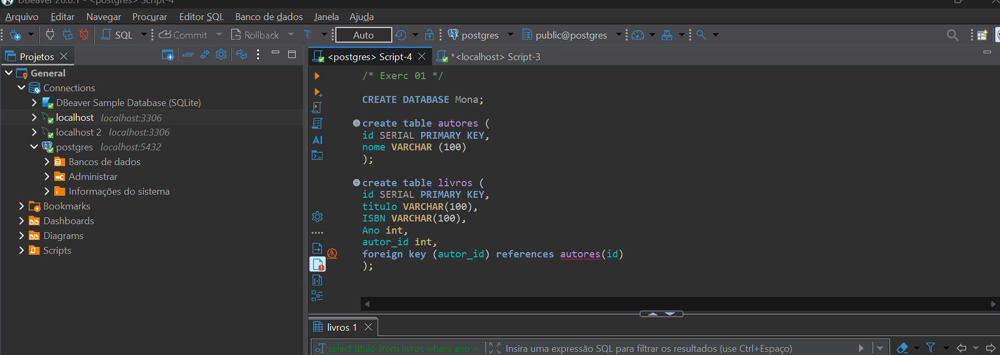
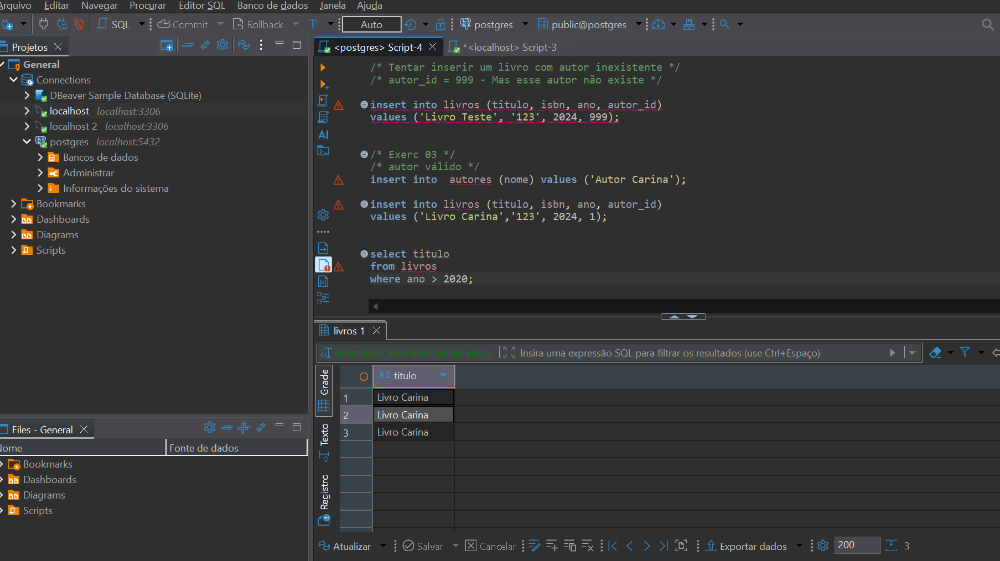

1. ERRO

A inserção não foi realizada porque a tabela livros possui uma chave estrangeira (autor_id) que referencia a tabela autores.
Ao tentar inserir um valor de autor_id que não existe na tabela autores, o banco de dados retorna um erro e impede a operação.
Isso ocorre para garantir a integridade referencial, evitando que registros fiquem associados a dados inexistentes e mantendo a consistência do banco de dados.

2. CRIAÇÂO

Foi criado o banco de dados chamado Mona para armazenar as informações do sistema.
Em seguida, foram criadas duas tabelas: autores e livros.

A tabela autores possui os campos id, que é a chave primária com auto incremento, e nome, que armazena o nome do autor.

A tabela livros contém os campos id, titulo, isbn, ano e autor_id. O campo autor_id é uma chave estrangeira que referencia o campo id da tabela autores.

Essa relação garante a integridade referencial, ou seja, um livro só pode ser cadastrado se estiver associado a um autor existente no banco de dados.

3. SUCESSO

O que você fez (explicação pronta)

Foi inserido um autor na tabela autores, garantindo um registro válido para relacionamento.
Em seguida, foi inserido um livro na tabela livros, utilizando o autor_id = 1, que corresponde ao autor previamente cadastrado.

Por fim, foi realizada uma consulta utilizando projeção e seleção, retornando apenas o título dos livros com ano de publicação superior a 2020.

Ligação com a teoria (importante mencionar)
Integridade referencial → respeitada (autor existe)
Projeção → SELECT titulo
Seleção → WHERE ano > 2020